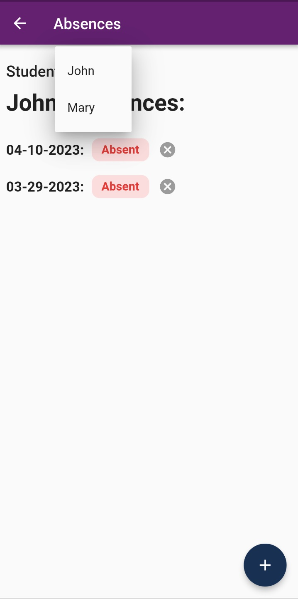

# FBLA Mobile Application

This is the documentation for the school planner application for FBLA Mobile App Development 2022-2023. This application was created by the following students: Rohit Karthik, Farzad Hasan, and Mitra.

## Technologies Used

This application uses the Dart programming language and the Flutter mobile app development framework. It also uses Firebase to store photos and user data. External libraries used include the Flutter OpenStreetMap API, Flutter Calendar View, BCrypt (for password encryption), and the Firebase APIs.

## Application Features

This application features a page for viewing events set up by school administration, a calendar page for students to track their own tasks, a photo share for people to share things they saw with everyone else at the school, and an absences page for reporting that a student was absent or late.

The application also has two other pages; one is a bus routes page that features a map view of the different bus routes that are avaiable for studnets, and the other is a club news page that shares different news stories about clubs at the school.

## How to Install the App
todo

## How to Use the App

### Login Page
The login page is the first page that the user sees when they open the app. The user can enter their email and password and click the login button to login to the app. If the user does not have an account, clicking the "Log In/Sign Up" button creates an account.

If the user would like, they can tap the "Report a Bug" button to open their preferred email client to send an email to the developers. The terms of use can be viewed by tapping the "Terms of Use" button.

### Home Page
The home page is the page that the user sees after they login. It has different buttons that allow the user to navigate to the different pages of the app. It also has social media links to directly access social media platforms if desired.

### Events Page
The events page is the page that the user sees when they tap the "Events" button on the home page. It has a list of events that the user can scroll through. The user can tap on an event to view more information about it.

An administrator account can tap the + icon in the bottom right corner to add an event that the whole school can view in the "Events" and "Calendar" pages.

### Calendar Page
The calendar page is the page that the user sees when they tap the "Calendar" button on the home page. It has a calendar that the user can scroll through to view the hours and events for days of the week. Tapping the arrows will cycle between the weeks. Tapping a colored box will give specific information about a particular event.

A purple box represents a personal event, while a blue box represents a school-wide event. You can tap the + icon in the bottom right corner to add a personal event.

### Photo Share Page
The photo share page is the page that the user sees when they tap the "Photos" button on the home page. It has a list of photos that the user can scroll through. The user can tap on a photo to zoom in to the photo if they desire.

A user can tap the + icon in the bottom right corner to add a photo that the whole school can view.

### Absences Page
The absences page is the page that the user sees when they tap the "Absences" button on the home page.

For a parent account, the page will show a list of their children at the top. Tapping on a child will show a list of their absences. Tapping the + icon in the bottom right corner will allow the parent to report an absence for their child. Tapping the "X" icon next to an absence will revoke it.

For a student account, the page will show a list of their absences.

Absences Page | Absences Page - Select a Student
:-------------------------:|:-------------------------:
 | 

### Bus Routes Page
The bus routes page is the page that the user sees when they tap the "Bus Routes" button on the home page. It has a map that the user can pan around to view the different bus routes.

### Club News Page
The club news page is the page that the user sees when they tap the "Club News" button on the home page. It has a list of news stories that the user can scroll through. The user can tap on a news story to view more information about it.

